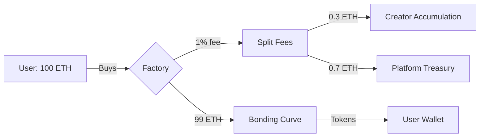
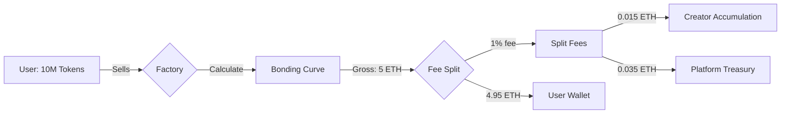
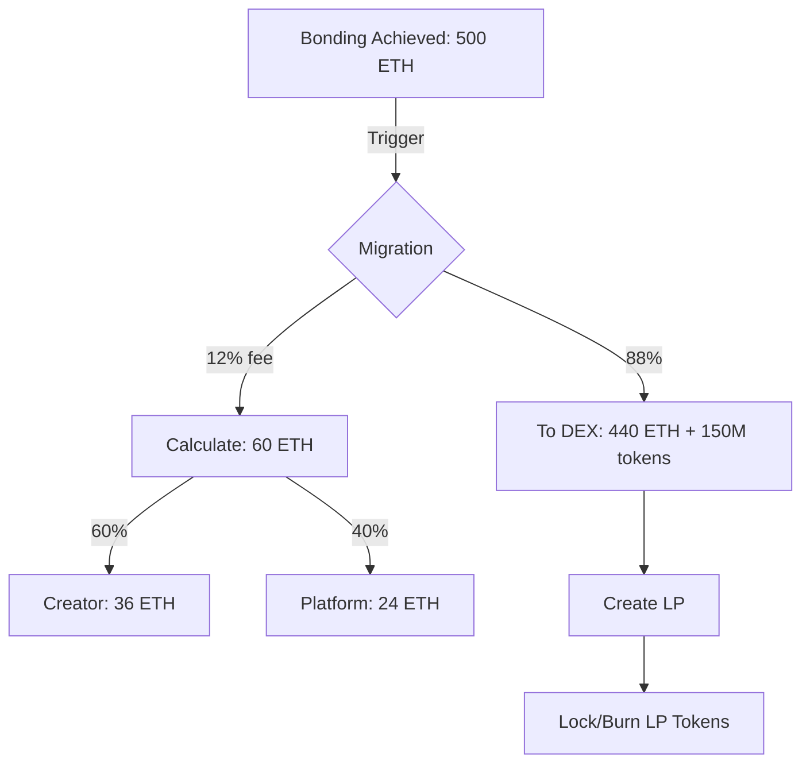

## Overview

RektHub's fee model aligns incentives between creators, communities, and the platform. No hidden charges, no surprise deductions—everything is transparent and on-chain.

<CardGroup cols={3}>
	<Card
		title='Trading Fees'
		icon='chart-line'
	>
		1% on all buys and sells
	</Card>
	<Card
		title='Creation Fees'
		icon='rocket'
	>
		One-time fee to launch
	</Card>
	<Card
		title='Migration Fees'
		icon='graduation-cap'
	>
		12% when graduating to DEX
	</Card>
</CardGroup>

---

## Trading Fees (1% Total)

Every buy and sell on RektHub incurs a **1% fee**. This fee is split between creator and platform.

### Creator Share: 30%

As a creator, you earn **30% of every trading fee** on your token. These fees accumulate in your bonding curve contract and can be claimed anytime.

<Tabs>
	<Tab title='How It Works'>
		```javascript
		// User buys $1,000 worth of your token
		const tradeAmount = 1000;
		const totalFee = tradeAmount * 0.01;  // $10
		
		// Fee split
		const yourShare = totalFee * 0.30;      // $3 (30%)
		const platformShare = totalFee * 0.70;  // $7 (70%)
		
		// Your $3 accumulates in curve
		accumulatedCreatorFees += yourShare;
		```
	</Tab>

    <Tab title='Claim Anytime'>
    	Fees don't transfer immediately—they accumulate to save gas. Call `claimCreatorFees()` whenever you want to withdraw.

    	```javascript
    	// Check accumulated fees
    	const [creator, fees] = await curve.getCreatorInfo();
    	console.log(`Claimable: ${ethers.formatEther(fees)} ETH`);

    	// Claim when ready
    	await curve.claimCreatorFees();
    	```

    	**No limits:** Claim once, claim daily, claim after bonding—it's your choice. No waiting periods, no restrictions.
    </Tab>

    <Tab title='Example Earnings'>
    	Track potential earnings at different volume levels:

    	| Daily Volume | Trading Fees (1%) | Your Share (30%) | Monthly Earnings |
    	|--------------|-------------------|------------------|------------------|
    	| $1,000 | $10 | $3 | $90 |
    	| $10,000 | $100 | $30 | $900 |
    	| $50,000 | $500 | $150 | $4,500 |
    	| $100,000 | $1,000 | $300 | $9,000 |
    	| $500,000 | $5,000 | $1,500 | $45,000 |
    </Tab>

</Tabs>

### Platform Share: 70%

The platform takes **70% of trading fees** to sustain infrastructure:

<AccordionGroup>
	<Accordion
		title='Cross-Chain Infrastructure'
		icon='globe'
	>
		- Intent-based routing via Khalani Network
		- Multi-chain settlement costs
		- Gas subsidies for certain operations
	</Accordion>

    <Accordion
    	title='Security & Audits'
    	icon='shield-check'
    >
    	- Smart contract audits
    	- Bug bounty programs
    	- Continuous security monitoring
    </Accordion>

    <Accordion
    	title='Platform Development'
    	icon='code'
    >
    	- Front-end hosting and APIs
    	- Real-time activity feeds
    	- Community chat infrastructure
    </Accordion>

    <Accordion
    	title='Future Features'
    	icon='magic-wand'
    >
    	- Enhanced creator tools
    	- Advanced analytics
    	- x402 features (coming soon)
    </Accordion>

</AccordionGroup>

<Info>
	**Sustainability model:** We don't have a platform token to dump on users.
	Trading fees fund everything. Aligned incentives—we only succeed when you
	succeed.
</Info>

---

## Creation Fees

Launching a token costs a **one-time creation fee**. This fee varies by chain to account for different gas costs and economic conditions.

### Current Fees by Chain

<Tabs>
	<Tab title='EVM Chains'>
		| Chain | Creation Fee | USD Equivalent* |
		|-------|--------------|-----------------|
		| Ethereum | 0.05 ETH | ~$150 |
		| Base | 0.01 ETH | ~$30 |
		| Arbitrum | 0.01 ETH | ~$30 |
		| Polygon | 20 MATIC | ~$20 |
		| BSC | 0.1 BNB | ~$60 |
		| Zircuit | 0.01 ETH | ~$30 |
		| Linea | 0.01 ETH | ~$30 |
		
		*USD values are approximate and vary with market prices
	</Tab>

    <Tab title='Coming Soon'>
    	| Chain | Estimated Fee | Status |
    	|-------|---------------|--------|
    	| Solana | 0.5 SOL | Q1 2025 |
    	| Avalanche | 1 AVAX | Q1 2025 |
    	| Optimism | 0.01 ETH | Q2 2025 |
    	| Sui | TBD | Q2 2025 |

    	Check [deployment addresses](/evm/deployment-addresses) for latest info.
    </Tab>

</Tabs>

### What Creation Fees Cover

<CardGroup cols={2}>
	<Card
		title='Gas Optimization'
		icon='gas-pump'
	>
		Deploy with minimal gas using clone pattern
	</Card>
	<Card
		title='Contract Initialization'
		icon='play'
	>
		Token and curve setup, factory registration
	</Card>
	<Card
		title='Indexing'
		icon='database'
	>
		Add token to discovery and tracking systems
	</Card>
	<Card
		title='Infrastructure'
		icon='server'
	>
		Metadata hosting, API access, community features
	</Card>
</CardGroup>

### Why Creation Fees?

<Accordion title='Prevents Spam'>
	Without creation fees, anyone could deploy thousands of tokens for pennies and
	clog the platform with scams.
</Accordion>

<Accordion title='Ensures Serious Creators'>
	The fee acts as "skin in the game"—creators who pay are more likely to build
	genuine communities.
</Accordion>

<Accordion title='Funds Initial Infrastructure'>
	Covers gas costs, indexing, and setup that happens before any trading fees are
	generated.
</Accordion>

<Warning>
	**Fees are non-refundable.** Make sure you're ready to commit to your token
	before launching.
</Warning>

---

## Migration Fees (12% of Liquidity)

When your token graduates to a DEX, RektHub charges a **12% fee** on the total liquidity being migrated. This fee rewards creators and sustains platform development.

### Creator Share: 60%

You get **60% of the migration fee**. This is a significant reward for building an active community that reached bonding.

<Steps>
	<Step title='Token Bonds'>
		850M tokens sold, curve has accumulated liquidity (e.g., 500 ETH)
	</Step>
	<Step title='Migration Fee Calculated'>12% of 500 ETH = 60 ETH total fee</Step>
	<Step title='You Get 60%'>
		60% of 60 ETH = 36 ETH added to your claimable fees
	</Step>
	<Step title='Platform Gets 40%'>
		40% of 60 ETH = 24 ETH sustains migration infrastructure
	</Step>
	<Step title='Liquidity to DEX'>
		440 ETH + 150M tokens create the liquidity pool
	</Step>
</Steps>

**Example Migration Fee Breakdown (500 ETH bonding):**

| Component         | Amount                    | Percentage | USD Value\*    |
| ----------------- | ------------------------- | ---------- | -------------- |
| Total Liquidity   | 500 ETH                   | 100%       | $1,500,000     |
| **Migration Fee** | **60 ETH**                | **12%**    | **$180,000**   |
| └─ Creator Gets   | 36 ETH                    | 60% of fee | $108,000       |
| └─ Platform Gets  | 24 ETH                    | 40% of fee | $72,000        |
| **To DEX**        | **440 ETH + 150M tokens** | **88%**    | **$1,320,000** |

\*Assumes ETH @ $3,000

<Tip>
	**Why 60% to creator?** Getting to bonding (850M tokens sold) means you built
	real demand. You earned this through community engagement, marketing, and
	delivering value.
</Tip>

### Platform Share: 40%

Platform takes **40% of migration fees** to fund:

<CardGroup cols={2}>
	<Card
		title='DEX Integrations'
		icon='plug'
	>
		Building and maintaining migrator contracts for multiple DEXes
	</Card>
	<Card
		title='Liquidity Infrastructure'
		icon='droplet'
	>
		Gas costs for creating pools, handling LP tokens
	</Card>
	<Card
		title='Migration Audits'
		icon='shield'
	>
		Security audits of all migration contracts
	</Card>
	<Card
		title='Future DEX Support'
		icon='plus'
	>
		Adding support for new DEXes and chains
	</Card>
</CardGroup>

### Migration Fee Examples

<Tabs>
	<Tab title='Small Token'>
		```
		Bonding liquidity: 100 ETH
		Migration fee: 12 ETH (12%)
		Creator gets: 7.2 ETH (60%)
		Platform gets: 4.8 ETH (40%)
		To DEX: 88 ETH + 150M tokens
		
		Creator's total earnings:
		  - Trading fees: ~$3,000
		  - Migration fee: ~$21,600
		  Total: ~$24,600
		```
	</Tab>

    <Tab title='Medium Token'>
    	```
    	Bonding liquidity: 500 ETH
    	Migration fee: 60 ETH (12%)
    	Creator gets: 36 ETH (60%)
    	Platform gets: 24 ETH (40%)
    	To DEX: 440 ETH + 150M tokens

    	Creator's total earnings:
    	  - Trading fees: ~$15,000
    	  - Migration fee: ~$108,000
    	  Total: ~$123,000
    	```
    </Tab>

    <Tab title='Large Token'>
    	```
    	Bonding liquidity: 2,000 ETH
    	Migration fee: 240 ETH (12%)
    	Creator gets: 144 ETH (60%)
    	Platform gets: 96 ETH (40%)
    	To DEX: 1,760 ETH + 150M tokens

    	Creator's total earnings:
    	  - Trading fees: ~$60,000
    	  - Migration fee: ~$432,000
    	  Total: ~$492,000
    	```
    </Tab>

</Tabs>

---

## Fee Distribution Flow

### On Buy Transaction



<CodeGroup>

```javascript Buy Fee Calculation
// User sends 100 ETH to buy tokens
const userSends = 100;

// Calculate 1% protocol fee
const totalFee = userSends * 0.01; // 1 ETH

// Split fee
const creatorFee = totalFee * 0.3; // 0.3 ETH (30%)
const platformFee = totalFee * 0.7; // 0.7 ETH (70%)

// Net to curve for trading
const netAmount = userSends - totalFee; // 99 ETH

// Calculate tokens from curve
const tokensOut = calculateBuyReturn(99);

// Update state
accumulatedCreatorFees += creatorFee; // 0.3 ETH saved for creator
transferToPlatform(platformFee); // 0.7 ETH sent immediately
transferToUser(tokensOut); // Tokens to buyer
```

```solidity Buy Implementation
function buy(address buyer, uint256 minTokensOut)
    external payable returns (TradeResult memory) {

    // 1. Calculate fees
    uint256 totalFee = msg.value * PROTOCOL_FEE_BPS / BASIS_POINTS;
    uint256 creatorFee = totalFee * CREATOR_SHARE_BPS / BASIS_POINTS;
    uint256 platformFee = totalFee - creatorFee;
    uint256 netAmount = msg.value - totalFee;

    // 2. Calculate tokens
    uint256 tokensOut = calculateBuyReturn(netAmount);
    require(tokensOut >= minTokensOut, "Slippage");

    // 3. Update state
    s_accumulatedCreatorFees += creatorFee;
    updateReserves(netAmount, tokensOut);

    // 4. Execute transfers
    IERC20(s_token).safeTransfer(buyer, tokensOut);
    s_factory.call{value: platformFee}("");

    return TradeResult(tokensOut, totalFee, creatorFee, platformFee);
}
```

</CodeGroup>

### On Sell Transaction



<CodeGroup>

```javascript Sell Fee Calculation
// User sells 10,000,000 tokens
const tokensSold = 10_000_000;

// Calculate gross native out (before fees)
const grossNative = calculateSellReturn(tokensSold); // 5 ETH

// Calculate 1% fee on gross
const totalFee = grossNative * 0.01; // 0.05 ETH

// Split fee
const creatorFee = totalFee * 0.3; // 0.015 ETH (30%)
const platformFee = totalFee * 0.7; // 0.035 ETH (70%)

// Net to user
const userReceives = grossNative - totalFee; // 4.95 ETH

// Update state
accumulatedCreatorFees += creatorFee; // 0.015 ETH saved
transferToPlatform(platformFee); // 0.035 ETH sent
transferToUser(userReceives); // 4.95 ETH to seller
```

```solidity Sell Implementation
function sell(address seller, uint256 tokenAmount, uint256 minNativeOut)
    external returns (TradeResult memory) {

    // 1. Calculate gross native (before fees)
    uint256 grossNative = calculateSellReturn(tokenAmount);

    // 2. Calculate fees
    uint256 totalFee = grossNative * PROTOCOL_FEE_BPS / BASIS_POINTS;
    uint256 creatorFee = totalFee * CREATOR_SHARE_BPS / BASIS_POINTS;
    uint256 platformFee = totalFee - creatorFee;
    uint256 nativeOut = grossNative - totalFee;

    require(nativeOut >= minNativeOut, "Slippage");

    // 3. Update state (use GROSS for reserves)
    s_accumulatedCreatorFees += creatorFee;
    updateReserves(grossNative, tokenAmount);

    // 4. Execute transfers
    IERC20(s_token).safeTransferFrom(seller, address(this), tokenAmount);
    seller.call{value: nativeOut}("");
    s_factory.call{value: platformFee}("");

    return TradeResult(nativeOut, totalFee, creatorFee, platformFee);
}
```

</CodeGroup>

### On Migration



<CodeGroup>

```javascript Migration Fee Calculation
// Token bonded with 500 ETH liquidity
const bondingLiquidity = 500;
const reservedTokens = 150_000_000;

// Calculate 12% migration fee
const migrationFee = bondingLiquidity * 0.12; // 60 ETH

// Split fee
const creatorFee = migrationFee * 0.6; // 36 ETH (60%)
const platformFee = migrationFee * 0.4; // 24 ETH (40%)

// Net liquidity to DEX
const liquidityToDEX = bondingLiquidity - migrationFee; // 440 ETH

// Execute migration
accumulatedCreatorFees += creatorFee; // 36 ETH saved for creator
transferToPlatform(platformFee); // 24 ETH sent
migrateToDEX(liquidityToDEX, reservedTokens); // Create LP
```

```solidity Migration Implementation
function migrate(address migrator) external returns (address pool, string memory dex) {
    require(s_bonded, "Not bonded");
    require(!s_graduated, "Already graduated");

    uint256 nativeLiquidity = s_realNativeReserves;
    uint256 tokenLiquidity = 150_000_000 * 10**18;

    // Calculate migration fee (12%)
    uint256 migrationFee = nativeLiquidity * MIGRATION_FEE_BPS / BASIS_POINTS;
    uint256 creatorFee = migrationFee * CREATOR_SHARE_MIGRATION_BPS / BASIS_POINTS;
    uint256 platformFee = migrationFee - creatorFee;
    uint256 netLiquidity = nativeLiquidity - migrationFee;

    // Update state
    s_graduated = true;
    s_accumulatedCreatorFees += creatorFee;
    clearReserves();

    // Execute migration
    s_factory.call{value: platformFee}("");
    IERC20(s_token).safeTransfer(migrator, tokenLiquidity);
    (pool, dex) = IDEXMigrator(migrator).migrate{value: netLiquidity}(
        s_token, netLiquidity, tokenLiquidity
    );

    emit TokenMigrated(s_token, pool, dex, netLiquidity, tokenLiquidity, migrationFee, creatorFee, platformFee);
}
```

</CodeGroup>

---

## Creator Earnings Examples

### Scenario 1: Small Community Token

<Accordion title="Token reaches bonding with modest volume">

```
Launch → Bonding Timeline: 3 months
Final bonding liquidity: 100 ETH

TRADING FEES EARNED:
- Total volume: $1M
- Trading fees (1%): $10,000
- Your share (30%): $3,000

MIGRATION FEE:
- Migration fee (12% of 100 ETH): 12 ETH
- Your share (60%): 7.2 ETH (~$21,600)

TOTAL CREATOR EARNINGS: ~$24,600
Not bad for 3 months of community building!
```

</Accordion>

### Scenario 2: Medium Viral Token

<Accordion title="Token gains traction, reaches bonding in 6 weeks">

```
Launch → Bonding Timeline: 6 weeks
Final bonding liquidity: 500 ETH

TRADING FEES EARNED:
- Total volume: $5M
- Trading fees (1%): $50,000
- Your share (30%): $15,000

MIGRATION FEE:
- Migration fee (12% of 500 ETH): 60 ETH
- Your share (60%): 36 ETH (~$108,000)

TOTAL CREATOR EARNINGS: ~$123,000
Life-changing money from a viral token!
```

</Accordion>

### Scenario 3: Major Success

<Accordion title="Token explodes, bonds in 2 weeks">

```
Launch → Bonding Timeline: 2 weeks
Final bonding liquidity: 2,000 ETH

TRADING FEES EARNED:
- Total volume: $20M
- Trading fees (1%): $200,000
- Your share (30%): $60,000

MIGRATION FEE:
- Migration fee (12% of 2,000 ETH): 240 ETH
- Your share (60%): 144 ETH (~$432,000)

TOTAL CREATOR EARNINGS: ~$492,000
Generational wealth from 2 weeks of work!
```

</Accordion>

---

## Fee Comparison

### RektHub vs Traditional Launches

**Cost comparison for launching a token:**

| Method        | Upfront Cost              | Creator Earnings                  | Community Trust                   |
| ------------- | ------------------------- | --------------------------------- | --------------------------------- |
| **RektHub**   | $30-150 creation fee      | 30% of trading + 60% of migration | ✅ High (fair launch)             |
| DEX Listing   | $50K-$500K                | 0% (unless you keep tokens)       | ⚠️ Medium (depends on tokenomics) |
| Market Makers | 10-20% of supply          | Depends on deal                   | ❌ Low (insider advantages)       |
| ICO/Presale   | $100K+ (legal, marketing) | Varies widely                     | ❌ Low (insider allocations)      |

<Info>
	**RektHub advantage:** Pay once, earn forever. No upfront capital, no supply
	giveaways, just sustainable creator economics.
</Info>

---

## FAQ

<AccordionGroup>
	<Accordion title="Can I change fee percentages for my token?">
		No, fees are hardcoded in the smart contracts to ensure consistency and trust. All tokens follow the same fee structure.
	</Accordion>

    <Accordion title="What if I don't claim my fees before migration?">
    	No problem! Your accumulated fees stay in the curve contract forever. Claim whenever you want, even years after migration.
    </Accordion>

    <Accordion title="Do I pay gas for fee accumulation?">
    	No! Fees accumulate in the curve contract. You only pay gas when you claim them.
    </Accordion>

    <Accordion title="Why is the migration fee so high (12%)?">
    	The 12% fee is substantial but fair:
    	- You get 60% of it (7.2% of total liquidity)
    	- It rewards successful community building
    	- Still leaves 88% for deep DEX liquidity
    	- Industry standard: most DEX launches cost 10-30% in various fees
    </Accordion>

    <Accordion title="Can I avoid the migration fee?">
    	No, the fee is charged automatically when migrating. But remember: you get 60% of it, so it's actually a reward for your success!
    </Accordion>

</AccordionGroup>

---

## Next Steps

<CardGroup cols={2}>
	<Card
		title='Token Migration'
		icon='graduation-cap'
		href='/getting-started/migration'
	>
		Learn how graduation works
	</Card>
	<Card
		title='Start Building'
		icon='code'
		href='/evm/quickstart'
	>
		Integrate fee tracking into your app
	</Card>
	<Card
		title='BondingCurve Contract'
		icon='file-contract'
		href='/evm/contracts/bonding-curve'
	>
		See fee calculation implementation
	</Card>
	<Card
		title='Creator Guide'
		icon='paintbrush'
		href='/evm/guides/creating-tokens'
	>
		Launch your first token
	</Card>
</CardGroup>
