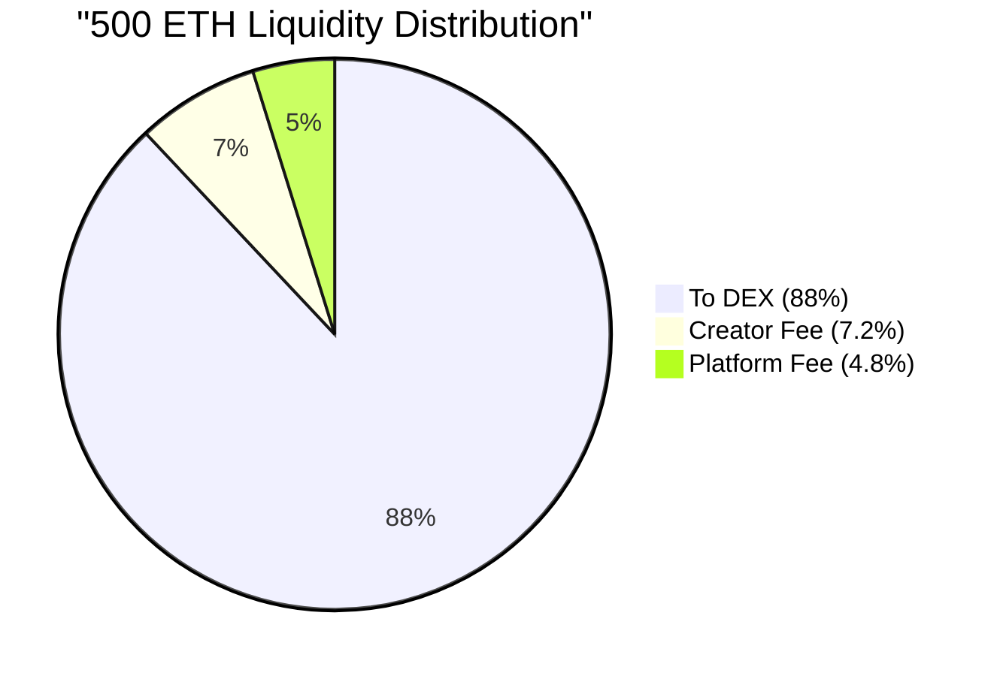
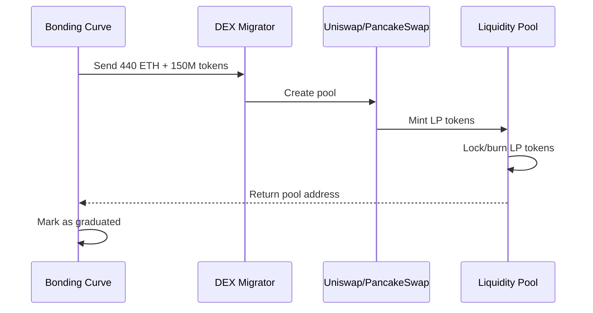

## What Is Token Graduation?

Migration—we call it **graduation**—is when your token moves from RektHub's bonding curve to a decentralized exchange (DEX) like Uniswap or PancakeSwap. It's not leaving RektHub; it's your token economy maturing into its next phase.

<Frame>
	
</Frame>

Think of it as your token's "graduation day" from the fair launch curve to the big leagues of DeFi liquidity.

<Info>
	**Graduation unlocks:** Deep liquidity, major DEX exposure, and often 5-10x
	price discovery for early believers.
</Info>

---

## When Can You Graduate?

Your token is eligible for graduation when **850 million tokens have been sold** from the bonding curve.

<Steps>
	<Step title='850M Tokens Sold'>
		All tradeable supply has been purchased from the curve
	</Step>
	<Step title='Token Marked as Bonded'>
		Trading on the curve stops automatically
	</Step>
	<Step title='Liquidity Accumulated'>
		Curve has substantial native currency (e.g., 500 ETH)
	</Step>
	<Step title='Ready for Graduation'>
		150M reserved tokens + accumulated liquidity ready to migrate
	</Step>
</Steps>

<Warning>
	**You cannot graduate early.** The 850M requirement ensures sufficient
	liquidity for a healthy DEX pool and rewards creators who build genuine demand.
</Warning>

<Accordion title="What's ready to migrate at bonding?">
```javascript
// Example bonding state
{
  realTokenReserves: 0,              // All 850M sold
  realNativeReserves: 500 ETH,       // Accumulated from sales
  reservedTokens: 150,000,000,       // Untouched supply for DEX
  accumulatedCreatorFees: 15 ETH,    // Your trading fees (claimable)
  status: "bonded",
  readyForGraduation: true
}
```
</Accordion>

---

## The Graduation Process

### 1. Bonding Achieved

When the 850 millionth token is sold, your token automatically enters the **"bonded" state**.

<CardGroup cols={2}>
	<Card
		title='Trading Stops'
		icon='ban'
	>
		No more buys or sells on the bonding curve
	</Card>
	<Card
		title='Liquidity Locked'
		icon='lock'
	>
		All accumulated native currency ready for migration
	</Card>
	<Card
		title='Reserved Supply'
		icon='vault'
	>
		150M tokens prepared for DEX liquidity
	</Card>
	<Card
		title='Creator Notified'
		icon='bell'
	>
		Time to choose your graduation destination
	</Card>
</CardGroup>

```solidity
// Bonding event emitted
event TokenBonded(address indexed tokenAddress);

// Curve state
s_bonded = true;
s_realTokenReserves = 0;
s_realNativeReserves = 500 ETH;  // Example
```

### 2. Choose Your DEX

As the creator, you control where your token graduates (assuming RektHub supports that DEX).

<Tabs>
	<Tab title='Uniswap'>
		**Best for:** Ethereum, Arbitrum, Base, Polygon
		
		**Pros:**
		- Deep liquidity across chains
		- Proven infrastructure
		- High trust and volume
		
		**Cons:**
		- Higher gas fees on Ethereum
	</Tab>

    <Tab title='PancakeSwap'>
    	**Best for:** BSC, Ethereum, Arbitrum

    	**Pros:**
    	- Multi-chain support
    	- Lower fees on BSC
    	- Large user base

    	**Cons:**
    	- Less liquidity on some chains
    </Tab>

    <Tab title='Aerodrome'>
    	**Best for:** Base

    	**Pros:**
    	- Base-native DEX
    	- Optimized routing
    	- Growing ecosystem

    	**Cons:**
    	- Limited to Base only
    </Tab>

    <Tab title='Coming Soon'>
    	More DEX integrations planned:
    	- Camelot (Arbitrum)
    	- Velodrome (Optimism)
    	- TraderJoe (Avalanche)
    	- QuickSwap (Polygon)

    	[Request a DEX](https://t.me/rekthub_io)
    </Tab>

</Tabs>

<Tip>
	**How to choose:** Consider where your community trades, which chain has lowest
	fees, and where you want long-term liquidity.
</Tip>

### 3. Migration Fee Charged

RektHub charges a **12% fee** on the total liquidity being migrated. This fee is split between you and the platform.

**Migration Fee Breakdown (500 ETH example):**



<CodeGroup>

```javascript Fee Calculation
// Bonding liquidity: 500 ETH
const bondingLiquidity = 500;

// Calculate 12% migration fee
const migrationFee = bondingLiquidity * 0.12; // 60 ETH

// Split fee
const creatorShare = migrationFee * 0.6; // 36 ETH (60%)
const platformShare = migrationFee * 0.4; // 24 ETH (40%)

// Net liquidity to DEX
const liquidityToDEX = bondingLiquidity - migrationFee; // 440 ETH

// Your total earnings
const tradingFees = 15; // Accumulated during bonding
const totalEarnings = tradingFees + creatorShare; // 51 ETH total
```

```solidity On-Chain Execution
// Migration function (simplified)
function migrate(address migrator) external {
    uint256 nativeLiquidity = s_realNativeReserves;

    // Calculate fees
    uint256 migrationFee = nativeLiquidity * 1200 / 10000;  // 12%
    uint256 creatorFee = migrationFee * 6000 / 10000;       // 60%
    uint256 platformFee = migrationFee - creatorFee;        // 40%
    uint256 netLiquidity = nativeLiquidity - migrationFee;

    // Update state
    s_graduated = true;
    s_accumulatedCreatorFees += creatorFee;

    // Execute migration
    transferToPlatform(platformFee);
    transferTokensToMigrator(150_000_000);
    migrator.migrate{value: netLiquidity}();
}
```

</CodeGroup>

<Accordion title="Why 60% to creator?">
Getting to bonding means you built **real demand**. You earned this through:

- Community engagement
- Marketing efforts
- Delivering value
- Building trust

The 60% creator share recognizes that achievement. It's a reward for success, not a tax.

</Accordion>

### 4. Liquidity Pool Created

The remaining liquidity (440 ETH + 150M tokens in our example) is sent to your chosen DEX where a liquidity pool is automatically created.



<Steps>
	<Step title='Assets Transferred'>
		440 ETH + 150M tokens sent to migrator contract
	</Step>
	<Step title='Pool Created'>
		Migrator calls DEX router to create liquidity pool
	</Step>
	<Step title='LP Tokens Minted'>
		DEX mints LP tokens representing pool ownership
	</Step>
	<Step title='LP Tokens Locked/Burned'>
		LP tokens typically burned or locked forever (no rug pull risk)
	</Step>
	<Step title='Trading Opens'>Token immediately tradeable on the DEX</Step>
</Steps>

<Info>
	**What happens on the DEX:** - Pool address: `0x...` (returned from migrator) -
	Initial price: Determined by 440 ETH : 150M ratio - LP tokens: Locked or burned
	(check specific DEX) - Trading: Live immediately
</Info>

### 5. Price Discovery Boost (IYKYK)

Here's the fun part. When 150M tokens hit the DEX against hundreds of ETH in liquidity, there's **immediate buying pressure**. Early bonding curve buyers often see **5-10x gains** at graduation.

<Frame>
	
</Frame>

#### Why the Graduation Pump?

<AccordionGroup>
	<Accordion
		title='New Supply Unlocked'
		icon='unlock'
	>
		Suddenly 150M tokens are available that weren't tradeable before. New buyers
		rush in.
	</Accordion>

    <Accordion
    	title='Deep Liquidity'
    	icon='droplet'
    >
    	440 ETH creates confidence. Traders see "real liquidity" and feel safe buying
    	large amounts.
    </Accordion>

    <Accordion
    	title='FOMO Effect'
    	icon='fire'
    >
    	"I missed the bonding curve at $0.00001, but I can still get in on DEX!" New
    	wave of buyers.
    </Accordion>

    <Accordion
    	title='No Sell Pressure'
    	icon='ban'
    >
    	Bonding curve sellers are done. Only DEX buyers remain. Supply/demand
    	imbalance = pump.
    </Accordion>

    <Accordion
    	title='Price Discovery'
    	icon='chart-line'
    >
    	New trading venue, new market dynamics. Often finds higher equilibrium price.
    </Accordion>

</AccordionGroup>

<Tip>
	**This rewards early believers** who bought on the curve at low prices. They
	exit into deep DEX liquidity at significantly higher prices.
</Tip>

#### Example Price Action

<Tabs>
	<Tab title='Pre-Graduation'>
		Bonding curve final state:
		- 850M tokens sold
		- 500 ETH accumulated
		- Price: ~$0.0000018 per token
		- Market cap: ~$1.8M (1B tokens)
	</Tab>

    <Tab title='At Graduation'>
    	DEX pool creation:
    	- 150M tokens added
    	- 440 ETH added
    	- Initial DEX price: 440 ETH / 150M = ~$0.0000088
    	- That's ~4.9x the bonding curve price!
    </Tab>

    <Tab title='Post-Graduation (24h)'>
    	After initial FOMO:
    	- DEX volume: $2M first day
    	- Price peaks: ~$0.000015 (8.3x curve price)
    	- Settles around: ~$0.00001 (5.5x curve price)
    	- Early buyers celebrating
    </Tab>

</Tabs>

---

## Post-Graduation

### Your Token Lives On

Graduation doesn't mean your token leaves RektHub. It means:

<CardGroup cols={2}>
	<Card
		title='Multi-Venue Trading'
		icon='shop'
	>
		Token trades on DEX + RektHub aggregators
	</Card>
	<Card
		title='Keep Accumulated Fees'
		icon='coins'
	>
		Claim your trading + migration fees anytime
	</Card>
	<Card
		title='Community Remains'
		icon='users'
	>
		Rekt Community chat, activity feeds still active
	</Card>
	<Card
		title='Creator Status'
		icon='crown'
	>
		Still your token, still your community
	</Card>
</CardGroup>

### What You Control

<Tabs>
	<Tab title='Metadata'>
		Update token image, description, socials anytime:
		
		```javascript
		// As creator, you can always update
		await token.setTokenURI("ipfs://new-metadata-hash");
		```
	</Tab>

    <Tab title='Community'>
    	- Moderate Rekt Community chat
    	- Post announcements
    	- Engage with holders
    	- Build on your success
    </Tab>

    <Tab title='Fee Claims'>
    	All accumulated fees remain claimable forever:

    	```javascript
    	// Check fees
    	const [creator, fees] = await curve.getCreatorInfo();

    	// Claim anytime (even years later)
    	await curve.claimCreatorFees();
    	```
    </Tab>

</Tabs>

### What You Don't Control

<Warning>
	**These are intentional protections:** - **Liquidity:** Once migrated,
	liquidity is locked/burned on DEX (no rug pulls) - **Trading:** Anyone can
	trade on the DEX without RektHub - **Price:** Market determines price, no more
	bonding curve math
</Warning>

---

## Migration Fee Structure (Detailed)

### Base Fee: 12% of Liquidity

The fee is applied to **total native currency** being migrated (not tokens).

**Migration Fee Examples:**

| Bonding Liquidity | Migration Fee (12%) | Creator Gets (60%) | Platform Gets (40%) | To DEX (88%)            |
| ----------------- | ------------------- | ------------------ | ------------------- | ----------------------- |
| 100 ETH           | 12 ETH              | 7.2 ETH            | 4.8 ETH             | 88 ETH + 150M tokens    |
| 250 ETH           | 30 ETH              | 18 ETH             | 12 ETH              | 220 ETH + 150M tokens   |
| 500 ETH           | 60 ETH              | 36 ETH             | 24 ETH              | 440 ETH + 150M tokens   |
| 1,000 ETH         | 120 ETH             | 72 ETH             | 48 ETH              | 880 ETH + 150M tokens   |
| 2,000 ETH         | 240 ETH             | 144 ETH            | 96 ETH              | 1,760 ETH + 150M tokens |

### Who Pays?

**Nobody directly.** The fee comes from the accumulated liquidity in the bonding curve. Users already contributed through trading during the bonding phase.

Think of it as a "success tax" on the liquidity pool, not an additional charge to users.

### When Is It Charged?

At the exact moment of migration. The smart contract:

<Steps>
	<Step title='Calculate Total Liquidity'>
		Get realNativeReserves from curve (e.g., 500 ETH)
	</Step>
	<Step title='Deduct 12% Fee'>500 × 0.12 = 60 ETH migration fee</Step>
	<Step title='Split 60/40'>Creator: 36 ETH, Platform: 24 ETH</Step>
	<Step title='Send Remaining to DEX'>440 ETH + 150M tokens create LP</Step>
</Steps>

**All in one transaction.** No manual steps, no delays, no trust required.

---

## Technical Implementation

### Migration Function

```solidity
function migrate(address migrator)
    external
    returns (
        address poolAddress,
        string memory platformName,
        uint256 nativeLiquidityAdded,
        uint256 tokenLiquidityAdded,
        uint256 migrationFee,
        uint256 creatorFee,
        uint256 platformFee
    )
{
    // 1. Authorization check
    require(msg.sender == s_factory, "Only factory");
    require(s_bonded, "Not bonded");
    require(!s_graduated, "Already graduated");
    require(migrator != address(0), "Invalid migrator");

    // 2. Get liquidity amounts
    uint256 nativeLiquidity = s_realNativeReserves;
    tokenLiquidityAdded = 150_000_000 * 10**18;
    address tokenAddress = s_token;

    // 3. Calculate fees
    migrationFee = nativeLiquidity * 1200 / 10000;  // 12%
    creatorFee = migrationFee * 6000 / 10000;        // 60%
    platformFee = migrationFee - creatorFee;         // 40%
    nativeLiquidityAdded = nativeLiquidity - migrationFee;

    // 4. Update state
    s_graduated = true;
    s_realNativeReserves = 0;
    s_realTokenReserves = 0;
    s_virtualNativeReserves = 0;
    s_virtualTokenReserves = 0;
    s_accumulatedCreatorFees += creatorFee;

    // 5. Execute transfers
    (bool successFactory,) = s_factory.call{value: platformFee}("");
    require(successFactory, "Platform fee transfer failed");

    IERC20(tokenAddress).safeTransfer(migrator, tokenLiquidityAdded);

    // 6. Call migrator
    try IDEXMigrator(migrator).migrate{value: nativeLiquidityAdded}(
        tokenAddress,
        nativeLiquidityAdded,
        tokenLiquidityAdded
    ) returns (address _poolAddress, string memory _platformName) {
        poolAddress = _poolAddress;
        platformName = _platformName;
    } catch {
        revert("Migration failed");
    }

    // 7. Emit event
    emit TokenMigrated(
        tokenAddress,
        poolAddress,
        platformName,
        nativeLiquidityAdded,
        tokenLiquidityAdded,
        migrationFee,
        creatorFee,
        platformFee
    );
}
```

### DEX Migrator Interface

Every DEX integrates through a standard interface:

```solidity
interface IDEXMigrator {
    /**
     * @notice Migrates liquidity to a DEX
     * @param token Token address to create pool for
     * @param nativeAmount Native currency to add to pool
     * @param tokenAmount Token amount to add to pool
     * @return poolAddress Address of created liquidity pool
     * @return platformName Name of the DEX platform
     */
    function migrate(
        address token,
        uint256 nativeAmount,
        uint256 tokenAmount
    ) external payable returns (
        address poolAddress,
        string memory platformName
    );
}
```

<Accordion title="Example Migrator Implementation (Uniswap)">

```solidity
contract UniswapMigrator is IDEXMigrator {
    IUniswapV2Router02 public immutable router;

    function migrate(
        address token,
        uint256 nativeAmount,
        uint256 tokenAmount
    ) external payable returns (address poolAddress, string memory platformName) {
        // 1. Approve router
        IERC20(token).approve(address(router), tokenAmount);

        // 2. Add liquidity
        (,, uint256 liquidity) = router.addLiquidityETH{value: nativeAmount}(
            token,
            tokenAmount,
            0,  // Accept any amount (migrator controls input)
            0,  // Accept any amount
            address(this),  // Receive LP tokens
            block.timestamp + 1
        );

        // 3. Get pool address
        address factory = router.factory();
        poolAddress = IUniswapV2Factory(factory).getPair(
            token,
            router.WETH()
        );

        // 4. Burn LP tokens (permanent liquidity lock)
        IERC20(poolAddress).transfer(address(0xdead), liquidity);

        platformName = "Uniswap V2";
    }
}
```

</Accordion>

---

## Who Triggers Graduation?

<Tabs>
	<Tab title='Current (Admin-Controlled)'>
		**RektHub admin** triggers migration when a token bonds. Creators request
		graduation via Telegram/support.
		
		**Process:**
		1. Token bonds (850M sold)
		2. Creator contacts RektHub team
		3. Chooses preferred DEX
		4. Admin triggers migration on-chain
		
		**Why admin-controlled for now?**
		- Ensures smooth migrations during early platform rollout
		- Testing with real liquidity before full automation
		- Prevents user error in high-stakes transactions
	</Tab>

    <Tab title='Coming Soon (Creator-Controlled)'>
    	Creators will trigger graduation themselves through the dashboard.

    	**Future process:**
    	1. Token bonds
    	2. Dashboard shows "Graduation Ready"
    	3. Creator selects DEX from dropdown
    	4. Clicks "Graduate Token"
    	5. Confirms transaction
    	6. Migration executes on-chain

    	**Timeline:** Q2 2025 (tentative)
    </Tab>

</Tabs>

<Info>
	**Building trust first.** We're making sure migrations work flawlessly before
	making them fully permissionless.
</Info>

---

## Common Questions

<AccordionGroup>
	<Accordion
		title='Can I graduate early?'
		icon='question'
	>
		No. The 850M requirement is hardcoded. It ensures sufficient liquidity and
		fair reward for community building.
	</Accordion>

    <Accordion
    	title="What if I don't want to graduate?"
    	icon='ban'
    >
    	You must graduate once bonded. The bonding curve stops trading at 850M sold.
    	Your token needs DEX liquidity to remain tradeable.
    </Accordion>

    <Accordion
    	title='Can I choose multiple DEXes?'
    	icon='layer-group'
    >
    	Not in one migration. You choose one DEX. After graduation, anyone can create
    	additional pools elsewhere if they want.
    </Accordion>

    <Accordion
    	title='What happens to my creator fees?'
    	icon='coins'
    >
    	They remain in your bonding curve contract forever. Claim anytime with
    	`claimCreatorFees()`. Graduation doesn't affect accumulated fees.
    </Accordion>

    <Accordion
    	title='Can I rug pull after graduation?'
    	icon='skull'
    >
    	No. LP tokens are typically burned or locked. You can't pull liquidity. This
    	is enforced by the DEX migrator contract.
    </Accordion>

    <Accordion
    	title='What if migration fails?'
    	icon='exclamation-triangle'
    >
    	The smart contract reverts the entire transaction. Liquidity stays in the
    	curve, state doesn't change, you can try again.
    </Accordion>

    <Accordion
    	title='Will my token still show on RektHub?'
    	icon='eye'
    >
    	Yes! Your token page, community chat, and activity feeds remain active.
    	Graduation doesn't remove you from RektHub.
    </Accordion>

    <Accordion
    	title='Can I migrate to a custom DEX?'
    	icon='gear'
    >
    	If you have a custom DEX and implement the IDEXMigrator interface, contact us.
    	We can potentially add support.
    </Accordion>

</AccordionGroup>

---

## Graduation Checklist

Before your token graduates, ensure:

<Steps>
	<Step title='850M Tokens Sold ✓'>
		Automatic requirement—just wait for bonding
	</Step>
	<Step title='Community is Active'>
		Engaged holders, strong social presence
	</Step>
	<Step title='Metadata Updated'>
		Token image, description, socials all current
	</Step>
	<Step title='DEX Chosen'>
		Decided where you want to graduate (Uniswap, PancakeSwap, etc.)
	</Step>
	<Step title='Fees Claimed (Optional)'>
		Claim any trading fees you want now (or wait)
	</Step>
	<Step title='Understand LP Locking'>
		LP tokens will be locked/burned—no rug pull possible
	</Step>
	<Step title='Ready to Celebrate 🎉'>
		Graduation is a milestone—enjoy it with your community!
	</Step>
</Steps>

---

## Next Steps

<CardGroup cols={2}>
	<Card
		title='Fee Structure'
		icon='coins'
		href='/getting-started/fee-structure'
	>
		Understand your migration fee earnings
	</Card>
	<Card
		title='Bonding Curves'
		icon='chart-area'
		href='/getting-started/bonding-curves'
	>
		Learn how tokens reach bonding
	</Card>
	<Card
		title='Create a Token'
		icon='rocket'
		href='/evm/guides/creating-tokens'
	>
		Launch your own creator token
	</Card>
	<Card
		title='Join Community'
		icon='telegram'
		href='https://t.me/rekthub_io'
	>
		Connect with other creators
	</Card>
</CardGroup>

<Note>
	**Ready to graduate?** When your token bonds, reach out on
	[Telegram](https://t.me/rekthub_io) and we'll help you through the process.
</Note>
