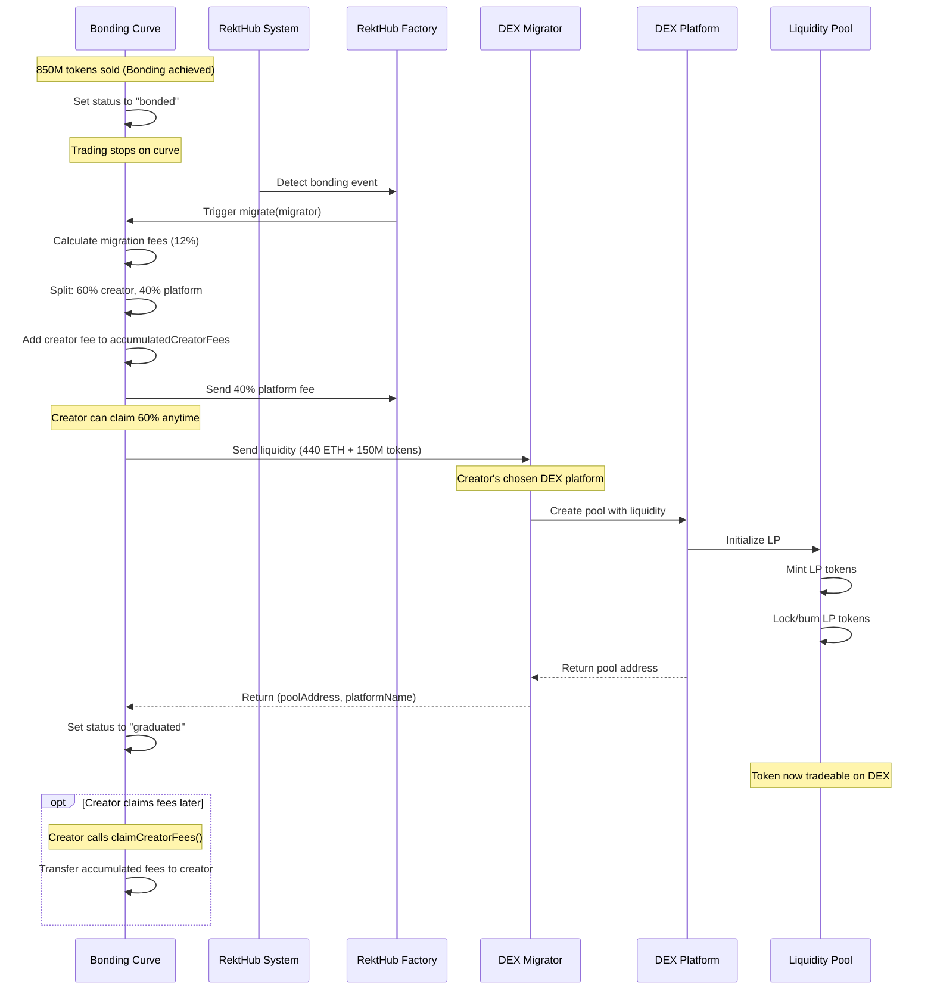
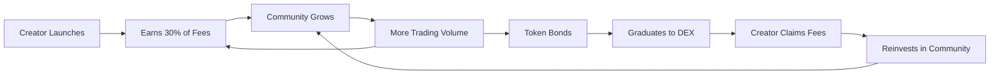

## The RektHub Flow

RektHub creates a seamless journey from token creation to community-driven trading to DEX graduation. Here's how the pieces fit together:

<Steps>
	<Step title='Creator Launches Token'>
		Pay a one-time fee, launch your token on any supported chain in minutes
	</Step>
	<Step title='Community Trades Cross-Chain'>
		Anyone buys from anywhere using their native crypto
	</Step>
	<Step title='Token Graduates to DEX'>
		After 850M tokens sold, migrate to a major DEX with deep liquidity
	</Step>
</Steps>

---

## 1. Creator Launches Token

A creator pays a one-time platform fee and launches their token on any supported chain—Ethereum, Base, Solana, Arbitrum, wherever their community lives. The process takes minutes, no code required.

<Frame>
	
</Frame>

### What Happens Behind the Scenes

<AccordionGroup>
	<Accordion title='1 billion tokens minted'>
		Total supply minted to an isolated bonding curve contract. No team tokens, no
		pre-sales.
	</Accordion>

    <Accordion title='Virtual liquidity activated'>
    	Virtual reserves (1.073B tokens + native) enable smooth price discovery from
    	day one.
    </Accordion>

    <Accordion title='Token becomes tradeable'>
    	Immediate trading starts. No waiting for liquidity providers or market makers.
    </Accordion>

    <Accordion title='Creator fee accumulation begins'>
    	30% of every trading fee starts accumulating for the creator.
    </Accordion>

</AccordionGroup>

### Fair Launch Guarantee

<Warning>
	**The creator gets zero tokens upfront.** Everyone, including the creator, buys
	from the same bonding curve. No special allocations, no insider advantages.
</Warning>

```solidity
// At launch
totalSupply = 1,000,000,000 tokens
tradeableSupply = 850,000,000 tokens (on curve)
reservedSupply = 150,000,000 tokens (for DEX graduation)

creatorBalance = 0 tokens (must buy like everyone else)
```

---

## 2. Community Trades Cross-Chain

This is where RektHub shines. Your token lives on Base, but someone on Solana wants in? They buy with SOL. Someone on Arbitrum? They use ETH. **RektHub's intent-based routing handles everything.**

<Frame>
	
</Frame>

### Under the Hood

<CardGroup cols={2}>
	<Card
		title='Intent-Based Routing'
		icon='route'
	>
		Powered by Khalani Network for seamless cross-chain settlement
	</Card>
	<Card
		title='Fast Settlement'
		icon='bolt'
	>
		Trades execute in under a minute across chains
	</Card>
	<Card
		title='No Manual Bridges'
		icon='ban'
	>
		No wrapped tokens, no manual bridging, little to no complexity
	</Card>
	<Card
		title='Unified Pricing'
		icon='scale-balanced'
	>
		All trades hit the same bonding curve regardless of source chain
	</Card>
</CardGroup>

<Tip>
	Learn more about intent-based routing in the [Khalani
	documentation](https://khalani.gitbook.io/khalani-docs/).
</Tip>

### Built-In Community Features

<Tabs>
	<Tab title='Rekt Community Chat'>
		Every token gets its own community space. Built-in, on-chain, no third-party
		platforms needed. 
		- Live chat on token pages: Token/Creator/Community driven conversations
	</Tab>

    <Tab title='Real-Time Activity'>
    	See what's happening as it happens:
    	- Price movements visualized with live charts
    </Tab>

    <Tab title='Coming Soon'>
    	- Creator utilities (x402): empower token holders by providing value/utilities for your tokens
    </Tab>

</Tabs>

---

## 3. Token Graduates to DEX

When **850 million tokens are sold** from the bonding curve, your token is ready to graduate. The creator controls where it goes, Uniswap, PancakeSwap, any supported DEX.

<Frame>
	
</Frame>

### What Happens at Graduation (Assuming 500 ETH accumulated, exaggerated figures)



<Steps>
	<Step title='Migration Fee Charged'>
		12% of liquidity taken as fee (60% to creator, 40% to platform)
	</Step>
	<Step title='Liquidity Migrated'>
		Remaining 150M tokens + accumulated native sent to DEX
	</Step>
	<Step title='LP Created'>
		Liquidity pool created automatically, LP tokens locked/burned
	</Step>
	<Step title='Price Discovery'>
		Immediate buying pressure often creates 5-10x gains for early buyers
	</Step>
</Steps>

<Info>
	**Example:** 500 ETH accumulated → 60 ETH migration fee → Creator gets 36 ETH →
	440 ETH + 150M tokens to DEX
</Info>

### The Price Bump (IYKYK)

When 150M tokens hit the DEX against hundreds of ETH in liquidity, there's an immediate price bump. Early bonding curve buyers often see **3-5x gains** at graduation.

**Why the mathematical advantage?**

The DEX pool starts with fundamentally better economics than the bonding curve:

- **Scarcity effect**: Only 150M tokens on pool (vs 850M that were sold on curve)
- **Same liquidity base**: All accumulated ETH from selling 850M tokens (minus 12% fee)
- **Better ratio**: Fewer tokens against the same liquidity = higher price floor
- **Supply shock**: 85% of supply already distributed, only 15% in the pool

**The Math:**

```
Bonding Curve at completion:
- 850M tokens sold for ~500 ETH
- Final price: ~$0.0000018 per token

DEX Pool at launch:
- 150M tokens paired with ~440 ETH (88% of accumulated liquidity)
- Initial price: ~$0.0000088 per token
- That's ~4.9x higher due to the improved token-to-ETH ratio
```

The graduation pump isn't hype, it's supply and demand fundamentals resetting with better parameters.

---

## 4. Beyond Token Launch

Tokens are just the entry point. RektHub is building the full creator economy stack:

<CardGroup cols={2}>
	<Card
		title='Monetization Without Ads'
		icon='dollar-sign'
	>
		Sustainable revenue from trading fees and future utilities
	</Card>
	<Card
		title='Community Tools'
		icon='users'
	>
		Enhanced chat, engagement rewards, governance features
	</Card>
	<Card
		title='Creator Utilities'
		icon='magic-wand'
	>
		Tools we're not ready to reveal yet (x402 incoming)
	</Card>
	<Card
		title='Cross-Chain Features'
		icon='globe'
	>
		Unified communities across all supported chains
	</Card>
</CardGroup>

---

## The Creator Economy Loop

This loop sustains itself without extractive tactics:



<Note>**Creator success = Community success = Platform success**</Note>

---

## Technical Foundation

<AccordionGroup>
	<Accordion
		title='Bonding Curves'
		icon='chart-line'
	>
		Proven constant product AMM mechanics (x × y = k) for fair price discovery.
		Virtual reserves ensure smooth early-stage pricing.
	</Accordion>

    <Accordion
    	title='Isolated Architecture'
    	icon='shield-halved'
    >
    	Each token gets its own trading contract. No shared state, no
    	cross-contamination, full isolation.
    </Accordion>

    <Accordion
    	title='Clone Pattern'
    	icon='copy'
    >
    	Gas-optimized deployments using OpenZeppelin's clone pattern. Deploy thousands
    	of tokens efficiently.
    </Accordion>

    <Accordion
    	title='No Custody'
    	icon='key'
    >
    	Your keys, your assets, always. RektHub never holds user funds.
    </Accordion>

</AccordionGroup>

---

## Next Steps

<CardGroup cols={2}>
	<Card
		title='Key Features'
		icon='star'
		href='/key-features'
	>
		Explore RektHub's full feature set
	</Card>
	<Card
		title='Bonding Curves'
		icon='chart-area'
		href='/getting-started/bonding-curves'
	>
		Deep dive into the mechanics
	</Card>
	<Card
		title='Fee Structure'
		icon='coins'
		href='/getting-started/fee-structure'
	>
		Understand creator economics
	</Card>
	<Card
		title='Start Building'
		icon='code'
		href='/evm/quickstart'
	>
		Integrate RektHub into your app
	</Card>
</CardGroup>
