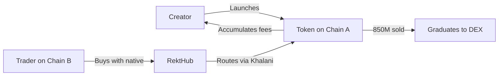

## What is RektHub?

RektHub is a **creator-token economy hub** that eliminates blockchain boundaries. We're not just another token launchpad, we're building infrastructure that empowers creators to build, monetize, and engage with communities across any chain.

Every chain today operates as an isolated island. Ethereum creators can't easily reach Solana users. Base tokens can't tap into Arbitrum liquidity. Communities are fragmented by the chains they're on. **RektHub changes this.**

<Frame>
	
</Frame>

## The Vision

Imagine launching a token on Base and having someone on Solana buy it with SOL in one click. No wrapped tokens, no friction. Your community united across chains, trading together, growing together. That's RektHub.

<CardGroup cols={2}>
	<Card
		title='For Creators'
		icon='paintbrush'
	>
		Launch tokens in minutes and earn from every trade (and more)
	</Card>
	<Card
		title='For Communities'
		icon='users'
	>
		Trade from any chain using it's native (e.g ETH for Base, Arbitrum, Ethereum)
	</Card>
	<Card
		title='For Traders'
		icon='chart-line'
	>
		Access opportunities from wherever you are
	</Card>
	<Card
		title='For Developers'
		icon='code'
	>
		Integrate creator-token economy model into your infrastructure/apps
	</Card>
</CardGroup>

## Why RektHub?

### For Creators

Launch your token on any chain, accumulate fees from every buy and sell, and control where your token graduates to. Even better sustainable creator economics (more in future).

<Tip>
	Creators earn **30% of all trading fees** plus **60% of the migration fee**
	when their token graduates to a DEX.
</Tip>

### For Communities

Trade from any chain using the natives of that chain. Built-in **Rekt Community chat** keeps everyone connected. Real-time activity feeds show what's happening. Your community isn't limited by which wallet you have.

### For Integrators

Contract is open source. Build dashboards, aggregators, bots, or full platforms on top of RektHub's infrastructure.

## What Makes Us Different

This isn't another pump-and-dump factory. RektHub uses proven **bonding curve mechanics** with fair launch guarantees. Creators don't get special allocations. Everyone buys from the same curve.

<Info>
	When **850 million tokens are sold**, your token graduates to a real DEX with
	deep liquidity automatically.
</Info>

Beyond tokens, we're building the full creator economy stack: monetization tools, engagement features, and utilities that empower creators without compromising their communities.

<Tip>More features coming soon. We're just getting started.</Tip>

## Get Started

<CardGroup cols={2}>
	<Card
		title='Join the waitlist'
		icon='rocket'
		href='#waitlist'
	>
		Join the waitlist to launch your creator token
	</Card>
	<Card
		title='Start Trading'
		icon='chart-candlestick'
		href='#waitlist'
	>
		Experience cross-chain trading when we launch
	</Card>
	<Card
		title='Integrate RektHub'
		icon='plug'
		href='/evm/quickstart'
	>
		Explore our EVM integration docs
	</Card>
	<Card
		title='Join Community'
		icon='telegram'
		href='https://t.me/rekthub_io'
	>
		Connect with creators and developers
	</Card>
</CardGroup>

## Architecture Overview

## Support & Resources

<CardGroup cols={3}>
	<Card
		title='GitHub'
		icon='github'
		href='https://github.com/organizations/RektHub-Ecosystem'
	>
		View our smart contracts
	</Card>
	<Card
		title='Telegram'
		icon='telegram'
		href='https://t.me/rekthub_io'
	>
		Join our community
	</Card>
	<Card
		title='X (Twitter)'
		icon='x-twitter'
		href='https://x.com/rekthub_io'
	>
		Follow for updates
	</Card>
</CardGroup>

---

<Note>
	**Ready to dive deeper?** Continue to [How It Works](/how-it-works) to
	understand the full ecosystem flow.
</Note>
